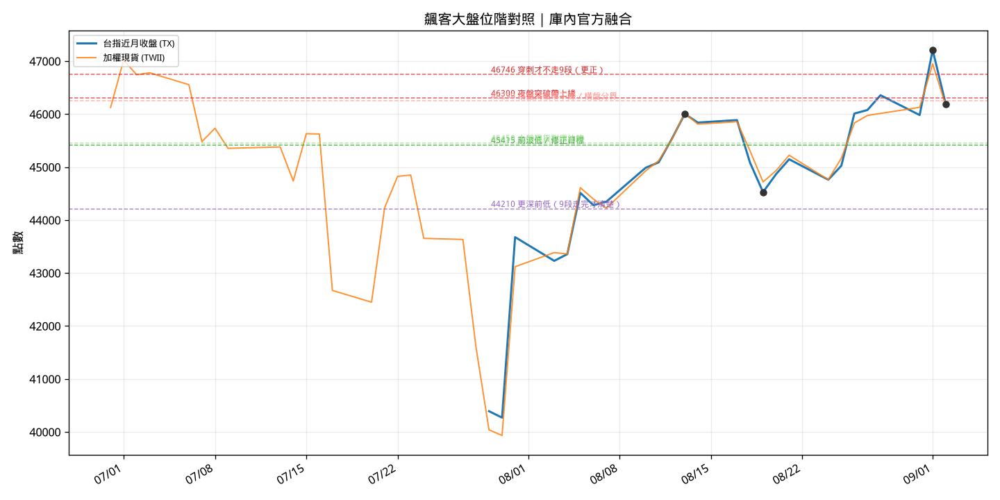

# 大盤細微波｜位階對照 digest（2026-09-02）

> **規則**：飆客提到「細微波／段數／夜盤位階」時，用 `scripts/render_expert_biaoke_chart.py` 從庫內 **TX 近月 + TWII 現貨** 出圖存檔，再與原文對照消化。  
> **不接入** WayneBot 選股；僅專家筆記歸檔。

---

## 他這批在說什麼（精髓）

飆客的「細微波」不是單看加權現貨日 K，而是 **台指期（夜盤）點數位階 + 下跌段數路徑**：

| 他的說法 | 解讀 |
|----------|------|
| 已跌 **7 段** | 從高點下來的細級修正浪，用段數描述「還沒跌完」 |
| 要穿刺 **46746** | 突破才**不走 9 段**（更深修正） |
| **46250～46300** | 夜盤有效突破才化解向下修正；只碰到 → **橫盤** |
| 最後還是會到 **45415** | 修正目標（前波低）；現貨大盤約 **45450** |
| **44210** | 若走滿 9 段才考慮的更深前低（他說還不清楚） |
| **右肩震盪** | 大結構仍偏多；區間大小不論，**最後還是往上** |
| **選股最重要** | 指數給風險框架，個股（光通訊）才是主戰場 |

---

## 庫內圖 vs 他的位階（20260902 基準）

| 位階 | 庫內驗證 | 備註 |
|------|----------|------|
| **46250** | ✅ 20260813 TX 日高 **46250** | 與他「突破帶」下緣完全重合 |
| **46300** | 20260901 TX 收 47209 高區 | 近期在帶之上；9/2 回檔至 46189 |
| **46746** | 20260901 夜盤高 **47220** 一帶 | 更正價在現有高點下方，需夜盤有效站回 |
| **45415** | 庫內 35 日 TX 低約 39442～42989 | **缺更長期貨史**；45415 應為他圖上更早波段低點，待補歷史 K 再標 |
| **44210** | 同上 | 需 backfill 更長 TAIFEX 史才能畫出 |

- **TX 收盤**（20260902）：46189  
- **TWII 收盤**（20260902）：46164.7（期現差約 +24，與他「大盤 45450 對期 45415」的現差邏輯一致）

### 段數粗估（zigzag 1.2%，僅輔助）

腳本對近月期貨做簡化 zigzag，**不可直接等同他的 7 段**。用途是：每次他更新段數時，用**同一套參數**重畫，看轉折點是否增加。

---

## 原文截圖存檔

| 檔案 | 內容 |
|------|------|
| [sources/01a062da-b9d4-…fa21.jpg](./sources/01a062da-b9d4-74a4-8ab8-677e20a1fa21.jpg) | 夜盤 46250～46300、7 段、45415、光通訊 |
| [sources/01a062da-ba09-…d83.jpg](./sources/01a062da-ba09-7130-860a-a33dff358d83.jpg) | 更正 46746、橫盤、45415 |
| 其餘三張 | PCB 金像電／金居、聯亞奇鋐（見主備忘錄） |

---

## 下次他再提細微波時

1. 更新 `docs/expert_notes/飆客.md` 時間軸  
2. 跑圖：`python3 scripts/render_expert_biaoke_chart.py --out docs/expert_notes/飆客/charts/index_levels_YYYYMMDD.png`  
3. 在本檔或新日期檔補「他的位階 vs 庫內高低」表  
4. 若位階需更長史（45415、44210），先 `sync_futures_daily(backfill_days=120)` 再重畫  

---

*建立：2026-09-02*
